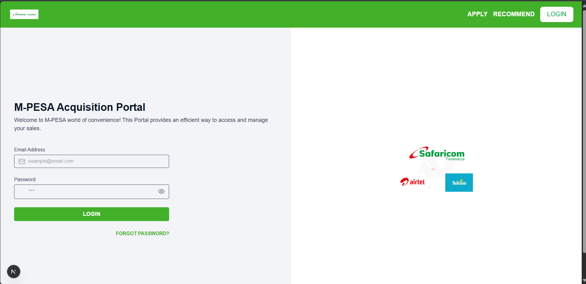
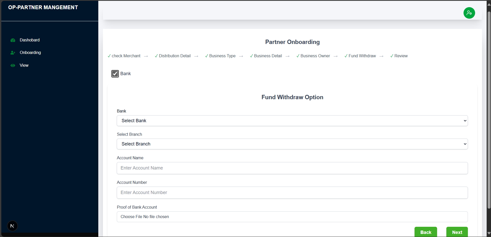

# Demo Frontend

This is a Next.js frontend project for the OP-Partner Management Portal, featuring Signin page a custom sidebar, and a KYC (Know Your Customer) onboarding flow. The UI uses Tailwind CSS for styling and React Icons/Lucide for iconography.

---

## Table of Contents

- [Features](#features)
- [Project Structure](#project-structure)
- [Getting Started](#getting-started)
- [Available Scripts](#available-scripts)
- [Customization](#customization)
- [Routing & Navigation](#routing--navigation)
- [Authentication](#authentication)
- [KYC Flow](#kyc-flow)
- [Styling](#styling)
- [Troubleshooting](#troubleshooting)
- [License](#license)

---

## Features

- **Next.js App Router** with server and client components
- **Custom Sidebar** with navigation and icons
- **Responsive Navbar** (default and dashboard-specific)
- **KYC Onboarding Form** with validation and file upload
- **Authentication Page** (Sign In)
- **Dashboard Layout** with conditional navbar rendering
- **Tailwind CSS** for rapid UI development

---

## Project Structure

```
app/
  components/
    AppShell.tsx
    navbar.tsx
    dashboard_navbar.tsx
    sidebar.tsx
    kyc_component/
      kyc.tsx
  kyc/
    page.tsx
  signin/
    page.tsx
  layout.tsx
  globals.css
public/
  safaricom_mpesa.png
  rightside_image.png
```
## Preview
### Signin Page



### KYC Page


---

## Getting Started

### Prerequisites

- Node.js (v18+ recommended)
- npm or yarn

### Installation

1. **Clone the repository:**
   ```sh
   git clone <your-repo-url>
   cd demo-frontend
   ```

2. **Install dependencies:**
   ```sh
   npm install
   # or
   yarn install
   ```

3. **Run the development server:**
   ```sh
   npm run dev
   # or
   yarn dev
   ```

4. Open [http://localhost:3000](http://localhost:3000) in your browser.

---

## Available Scripts

- `npm run dev` — Start the development server
- `npm run build` — Build for production
- `npm run start` — Start the production server

---

## Customization

### Sidebar

- Located in `app/components/sidebar.tsx`
- Edit the links and icons as needed.
- Uses `react-icons` for iconography.

### Navbar

- Default navbar: `app/components/navbar.tsx`
- Dashboard-specific navbar: `app/components/dashboard_navbar.tsx`
- The navbar is conditionally rendered using `AppShell.tsx` based on the route.

### KYC Form

- Located in `app/components/kyc_component/kyc.tsx`
- Multi-step form with validation and file upload.

---

## Routing & Navigation

- **Sidebar** navigation uses Next.js `<Link>` for client-side routing.
- **Conditional Navbar:**  
  The default navbar is hidden on `/kyc` routes and replaced with the dashboard navbar.

  This is handled in `AppShell.tsx`:
  ```tsx
  // AppShell.tsx
  'use client';
  import Navbar from './navbar';
  import { usePathname } from 'next/navigation';

  export default function AppShell({ children }) {
    const pathname = usePathname();
    const hideNavbar = pathname.startsWith('/kyc');
    return (
      <>
        {!hideNavbar && <Navbar />}
        {children}
      </>
    );
  }
  ```

---

## Authentication

- **Sign In Page:**  
  Located at `/signin` (`app/signin/page.tsx`)
- Handles username and password input, with show/hide password toggle.
- On submit, sends a POST request to `http://localhost:8000/token`.

---

## KYC Flow

- **KYC Page:**  
  Located at `/kyc` (`app/kyc/page.tsx`)
- Uses a sidebar (20% width) and main content (80% width) layout.
- The KYC form includes:
  - Bank selection
  - Branch selection
  - Account details
  - File upload for proof

---

## Styling

- **Tailwind CSS** is used throughout the project.
- Custom colors and responsive classes are used for layout and components.
- Icons are from `react-icons` and `lucide-react`.

---

## Troubleshooting

### Metadata Export Error

If you see:
```
Error: × You are attempting to export "metadata" from a component marked with "use client", which is disallowed.
```
**Solution:**  
- Ensure `layout.tsx` does NOT have `'use client'` at the top.
- Move any client-only logic (like hooks) into a separate client component (e.g., `AppShell.tsx`).

### Sidebar or Navbar Not Displaying Correctly

- Check your import paths.
- Ensure you are using the correct layout structure in your page files.
- Make sure Tailwind CSS is properly configured.


---
